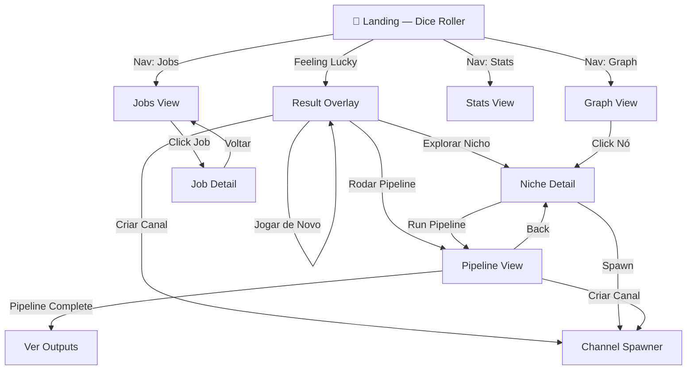
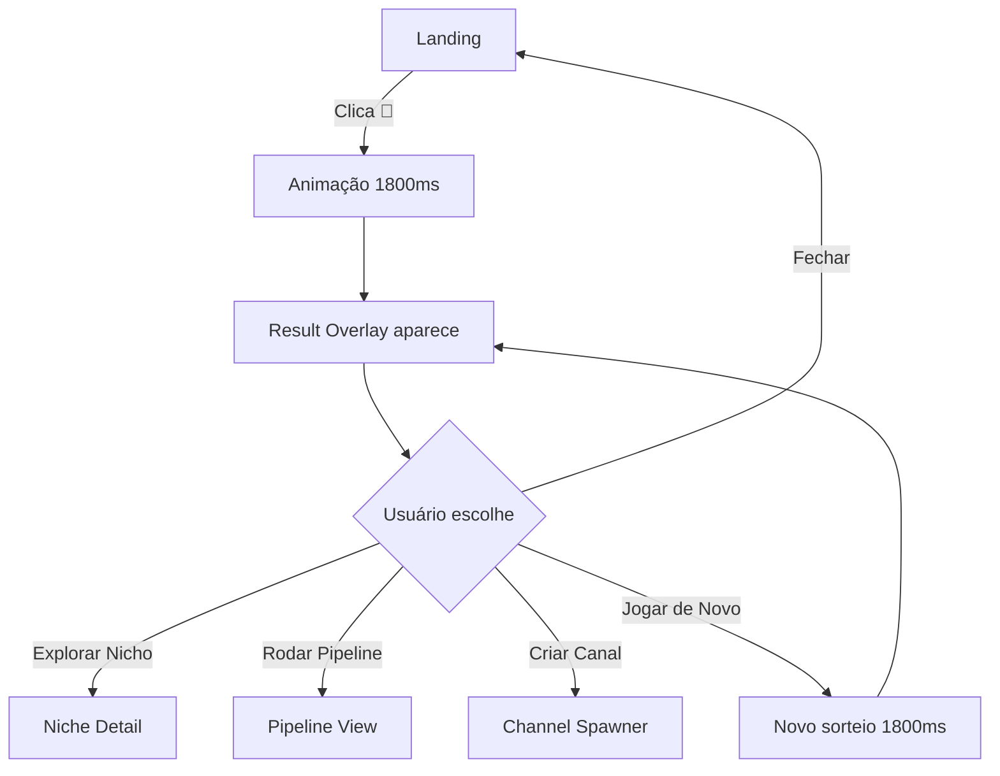
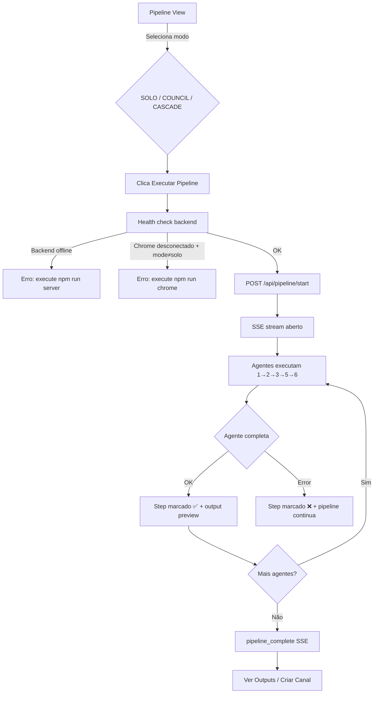
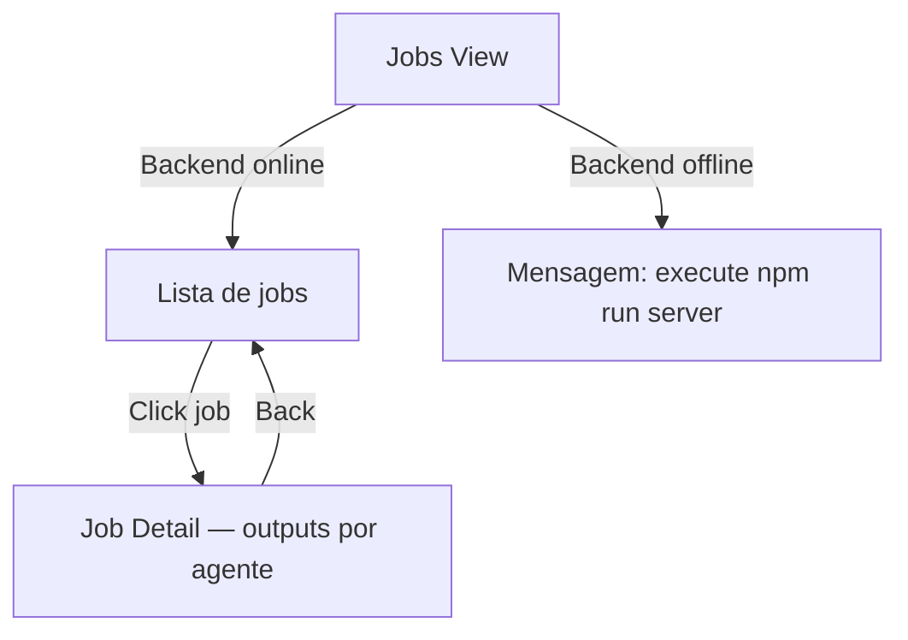

# BRAINET MVP — Frontend/UX Specification

**Data:** 2026-02-23
**Versão:** 1.0
**Autor:** @ux-design-expert (Uma)
**Escopo:** Análise brownfield completa do estado atual do frontend — para Brownfield Discovery FASE 3

---

## Change Log

| Data | Versão | Descrição | Autor |
|------|--------|-----------|-------|
| 2026-02-23 | 1.0 | Análise brownfield inicial | @ux-design-expert |

---

## 1. Visão Geral do Sistema UI

### Propósito
BRAINET MVP é uma ferramenta de produção de conteúdo orientada por IA. O frontend serve como:
1. **Interface de descoberta** — o usuário explora um universo de nichos/ângulos via "dados"
2. **Disparador de pipeline** — seleciona parâmetros e aciona o backend AI
3. **Monitor de progresso** — acompanha execução em tempo real via SSE
4. **Histórico de jobs** — consulta outputs anteriores

### Stack Frontend Atual

| Componente | Tecnologia | Notas |
|-----------|-----------|-------|
| Build | Vite 6 | ESM nativo |
| Framework | Vanilla JS | Sem React/Vue/Svelte |
| Roteamento | Manual (switch/map) | Sem URL updates, sem history API |
| Tipagem | Nenhuma | Sem TypeScript |
| Estilos | CSS custom properties | Monolítico (27KB) |
| Visualização | vis-network + vis-data | Para o grafo de nichos |
| Animações | CSS + canvas (particles) | Sem biblioteca |
| Real-time | SSE (EventSource) | Sem WebSocket |

---

## 2. Arquitetura de Informação

### Mapa de Telas



### Navegação Principal

**Nav Bar (fixed top):**
- `🎲 Dice` → Landing
- `🕸️ Graph` → Graph View
- `📊 Stats` → Stats View
- `📋 Jobs` → Jobs View

**Nota:** Channel Spawner e Pipeline NÃO estão na nav principal. São acessados apenas via overlay/niche-detail. Isso cria um fluxo oculto.

---

## 3. Personas de Usuário (Inferidas)

### Persona A: Criador Solo

> "Preciso de ideias de conteúdo rápido para meu canal de espiritualidade."

- Usa o dado para descoberta aleatória
- Quer disparar o pipeline e obter roteiros prontos
- Não tem interesse técnico no funcionamento interno
- **Dor:** Não sabe que precisa do HD externo para o pipeline funcionar

### Persona B: Operador de Conteúdo

> "Gerencio vários canais e quero automatizar a produção em escala."

- Quer navegar pelo grafo para ver todos os nichos
- Usa a view de jobs para acompanhar execuções simultâneas
- Precisa de acesso fácil aos outputs gerados
- **Dor:** Outputs truncados em 5KB na UI; referência para "workspace" que não existe na UI

### Persona C: Desenvolvedor/Integrador

> "Quero entender o sistema para adaptar ou expandir."

- Interessado na arquitetura e configuração
- Usa o /api/health para checar o estado
- **Dor:** API_BASE hardcoded em cada arquivo; sem documentação inline da UI

---

## 4. Fluxos de Usuário

### Fluxo 1: Feeling Lucky (Principal)

**Goal:** Descobrir um ângulo de conteúdo em 1 clique



**Edge Cases identificados:**
- ⚠️ Não há loading state durante os 1800ms de animação — usuário pode clicar novamente
- ⚠️ Click fora do overlay fecha — mas há CTA de "fechar" redundante
- ⚠️ Sem feedback de "nicho já muito explorado"

---

### Fluxo 2: Executar Pipeline Real

**Goal:** Gerar conteúdo completo para um ângulo via AI



**Edge Cases identificados:**
- ⚠️ Se SSE cai antes do pipeline terminar, não há reconexão automática
- ⚠️ Output truncado em 500 chars na preview; resto só no workspace externo
- ⚠️ Sem forma de cancelar pipeline em andamento
- ⚠️ Back button durante pipeline em andamento não avisa o usuário

---

### Fluxo 3: Consultar Jobs



**Edge Cases identificados:**
- ⚠️ Sem paginação — lista cresce indefinidamente
- ⚠️ Output truncado em 5KB com msg "[ver completo no workspace]" — dead-end para usuário
- ⚠️ Sem filtro por status, nicho ou data

---

## 5. Inventário de Componentes (Atomic Design)

### Átomos Existentes

| Componente | Classes | Variantes | Problemas |
|-----------|---------|-----------|-----------|
| Button | `.btn` | `.btn-primary`, `.btn-danger`, `.btn-glow`, `.back-btn` | Sem disabled state documentado, sem foco visível |
| Badge | `.step-badge` | `mock`, `real` | Hard-coded via classList |
| AI Indicator | `.ai-indicator` | `available`, `unavailable` | Sem estado loading |
| Stat Item | `.stat-item` | — | Sem estado zero |
| Nav Link | `.nav-link` | `active` | Sem foco via teclado |

### Moléculas Existentes

| Componente | Composição | Problemas |
|-----------|-----------|-----------|
| Dice Button | emoji + label + animação CSS | Sem aria-live para resultado |
| Pipeline Step | dot + header + status + output | Criado dinamicamente via innerHTML |
| Result Card | color-bar + header + path + angle + actions | Appended ao body (z-index risk) |
| Stats Strip | 5x stat-item | Sem responsividade |
| Council Mode Selector | 3x mode-btn + 3x ai-indicator | Sem keyboard nav |

### Organismos Existentes

| Componente | View | Problemas |
|-----------|------|-----------|
| Navigation Bar | Global | Sem mobile menu |
| Landing Hero | Landing | Sem responsividade |
| Result Overlay | Landing → Modal | Sem trap de foco |
| Pipeline Flow | Pipeline | Sem skeleton loading |
| Jobs List | Jobs | Sem paginação |

---

## 6. Design System — Estado Atual

### Tokens Definidos (CSS Custom Properties)

O sistema JÁ possui uma base de design tokens bem estruturada em `src/style.css`:

#### Cores
```css
/* Backgrounds */
--bg-primary: #06060e       /* Dark space */
--bg-secondary: #0d0d1a
--bg-card: rgba(15,15,30,0.7)
--bg-glass: rgba(20,20,40,0.5)
--bg-hover: rgba(30,30,60,0.6)

/* Text */
--text-primary: #e8e8f0
--text-secondary: #9090b0
--text-muted: #606080
--text-accent: #a78bfa      /* Purple */

/* Borders */
--border-subtle: rgba(100,100,180,0.15)
--border-glow: rgba(139,92,246,0.3)

/* Niche Colors (8 cores temáticas) */
--niche-espiritualidade: #8B5CF6
--niche-saude: #06B6D4
--niche-temperanca: #10B981
--niche-paciencia: #F59E0B
--niche-tech: #3B82F6
--niche-filosofia: #EC4899
--niche-financas: #EF4444
--niche-artes: #F97316
```

#### Tipografia
```css
--font-body: 'Inter', system-ui
--font-mono: 'JetBrains Mono', monospace
/* Escala de tamanhos: não tokenizada (valores hardcoded nas views) */
```

#### Espaçamento
```css
--space-xs: 4px
--space-sm: 8px
--space-md: 16px
--space-lg: 24px
--space-xl: 32px
--space-2xl: 48px
--space-3xl: 64px
```

#### Border Radius
```css
--radius-sm: 8px
--radius-md: 12px
--radius-lg: 16px
--radius-xl: 24px
--radius-full: 9999px
```

#### Sombras
```css
--shadow-sm / --shadow-md / --shadow-lg / --shadow-glow
```

#### Animações
```css
--ease-out: cubic-bezier(0.16, 1, 0.3, 1)
--ease-spring: cubic-bezier(0.34, 1.56, 0.64, 1)
--duration-fast: 150ms
--duration-normal: 300ms
--duration-slow: 500ms
```

**Avaliação:** Base de tokens sólida e bem pensada. Problema: não está sendo consumida de forma consistente. As views constroem HTML via template literals com estilos inline misturados com variáveis.

---

## 7. Débitos UX/UI Identificados

### CRÍTICO

| ID | Débito | Localização | Impacto |
|----|--------|------------|---------|
| UX-01 | `API_BASE = 'http://localhost:3001'` hardcoded em 3+ arquivos de view | `pipeline.js`, `jobs.js`, `stats.js` | Quebra em qualquer deploy |
| UX-02 | Sem responsividade — nenhum breakpoint definido | `style.css` global | Inutilizável em mobile |
| UX-03 | `escapeHtml()` duplicada em `jobs.js` e `pipeline.js` | — | DRY violation, risco de XSS se mantida inconsistente |
| UX-04 | Result overlay appended diretamente ao `document.body` sem trap de foco ou role="dialog" | `landing.js:70` | Acessibilidade crítica |
| UX-05 | Pipeline outputs truncados na UI ("ver completo no workspace") — dead-end | `jobs.js`, `pipeline.js` | Experiência truncada para usuário final |

### ALTO

| ID | Débito | Localização | Impacto |
|----|--------|------------|---------|
| UX-06 | Sem skeleton loaders em nenhuma view assíncrona | Todas as views | UX percebida como lenta |
| UX-07 | Sem estados de erro para falhas de API além do pipeline | `stats.js`, `graph.js` | Falha silenciosa |
| UX-08 | Sem URL changes no router (sem history API) | `main.js` | Sem deep link, back button do browser não funciona |
| UX-09 | Animação do dado de 1800ms sem opção de pular | `landing.js:56` | Frustrante em uso repetido |
| UX-10 | Sem feedback de cancelamento de pipeline em andamento | `pipeline.js` | Usuário preso em loading |
| UX-11 | Sem reconexão automática se SSE cair durante pipeline | `pipeline.js` | Pipeline "sumido" para o usuário |
| UX-12 | Nav bar não tem acesso a Channel Spawner e Pipeline View | `index.html` | Features principais "escondidas" |

### MÉDIO

| ID | Débito | Localização | Impacto |
|----|--------|------------|---------|
| UX-13 | `src/style.css` monolítico (27KB) sem organização por componente | — | Colisões CSS, difícil manutenção |
| UX-14 | Valores de tamanho de fonte hardcoded nas views (ex: `font-size: 0.75rem`) em vez de tokens | Todas as views | Inconsistência |
| UX-15 | Sem paginação na jobs list | `jobs.js` | Performance degradada com muitos jobs |
| UX-16 | Sem filtros na jobs list (status, nicho, data) | `jobs.js` | Difícil de usar com muitos jobs |
| UX-17 | Back button inconsistente: pipeline volta para niche-detail mas exige `data.nicho` | `pipeline.js:83` | Possível crash se dado não disponível |
| UX-18 | Sem empty states para quando nichos não carregam | `landing.js` | Tela em branco |
| UX-19 | Sem feedback visual de qual nicho/ângulo será executado antes de confirmar pipeline | `pipeline.js` | Falta de confirmação |
| UX-20 | `renderObj()` duplicada apenas em `pipeline.js` como util inline | `pipeline.js:390` | Deveria ser util compartilhada |

### BAIXO

| ID | Débito | Localização | Impacto |
|----|--------|------------|---------|
| UX-21 | Sem lazy loading do vis-network (bundle pesado carregado sempre) | `package.json` | Performance inicial |
| UX-22 | Sem dark/light mode toggle (dark-only atualmente) | CSS global | Preferência de usuário |
| UX-23 | Emojis como ícones (não escaláveis, sem fallback) | Toda a UI | Acessibilidade e consistência |
| UX-24 | Sem indicação de quantos nichos já foram completamente explorados | `landing.js` | Falta de gamificação |
| UX-25 | Council mode "COUNCIL" requer Chrome aberto — não informado proativamente | `pipeline.js` | Frustração em runtime |

---

## 8. Acessibilidade — Estado Atual

| Critério WCAG | Status | Notas |
|--------------|--------|-------|
| 1.1.1 Alt text | ⚠️ Parcial | Dice button tem aria-label, demais elementos não |
| 1.4.3 Contraste | ✅ Provável | Dark theme com texto claro, mas não auditado |
| 2.1.1 Teclado | ❌ Falha | Nav links sem foco visível; overlay sem trap; modal sem ARIA |
| 2.4.3 Foco | ❌ Falha | Sem focus visible consistente |
| 3.2.2 Input | ⚠️ N/A | Sem formulários complexos atualmente |
| 4.1.2 Nome/Função | ❌ Falha | Botões com apenas emoji sem aria-label |
| ARIA landmarks | ❌ Ausente | Sem `<main>`, sem `role="dialog"` no overlay |

**Conclusão:** A UI não atende WCAG AA. Foco mínimo necessário em: trap de foco no modal, aria-labels, e foco visível.

---

## 9. Responsividade — Estado Atual

**Breakpoints definidos:** ❌ Nenhum

A UI foi desenvolvida exclusivamente para desktop. Problemas específicos:
- Nav bar sem menu hamburguer para mobile
- Stats strip com 5 colunas (colapsaria em mobile)
- Pipeline steps com layout horizontal que colide
- Result overlay com card largo sem max-width adaptativa
- Padding fixos inadequados para telas pequenas

**Largura mínima funcional atual:** ~1024px (estimado)

---

## 10. Performance — Estado Atual

| Métrica | Estado | Notas |
|---------|--------|-------|
| Bundle size | ⚠️ Não medido | vis-network é ~500KB |
| Code splitting | ❌ Ausente | Tudo carregado na inicialização |
| Lazy loading | ❌ Ausente | Graph view carrega vis-network mesmo sem uso |
| Cache | ✅ Vite default | Cache de módulos |
| Animations | ✅ CSS-based | GPU-accelerated onde possível |
| Particles canvas | ⚠️ Sempre ativo | Canvas animado rodando em todas as views |

---

## 11. Padrões Inconsistentes

### Construção de HTML
Toda a UI usa template literals com innerHTML. Padrão espalhado em 7 arquivos sem abstração de componente. Isso torna difícil:
- Reusar componentes
- Testar elementos isolados
- Evitar XSS (escapeHtml manual e incompleto)

### Event Listeners
Listeners adicionados diretamente em elementos recém-criados. Sem sistema de remoção → potenciais memory leaks ao navegar entre views (views são substituídas mas listeners podem persistir em closures).

### Comunicação de Estado
- Dados de nicho passados como objeto JS via `navigateTo(view, data)`
- Sem store central
- Pipeline view crasha se `data.nicho` não estiver presente (redirect para landing, mas sem mensagem)

---

## 12. Recomendações Prioritárias

### Quick Wins (1-3 dias)
1. Extrair `API_BASE` para constante central `src/config.js` (UX-01)
2. Extrair `escapeHtml()` para `src/utils.js` (UX-03)
3. Adicionar `aria-label` nos botões de emoji (UX-23)
4. Adicionar `role="dialog"` e trap de foco no result overlay (UX-04)

### Fundação (1-2 semanas)
5. Implementar history API no router (`/`, `/graph`, `/jobs`) (UX-08)
6. Adicionar skeleton loaders nas views assíncronas (UX-06)
7. Implementar breakpoints mobile (min: 320px, tablet: 768px, desktop: 1024px) (UX-02)
8. Separar CSS por componente (atomic) e remover monolítico (UX-13)

### Médio Prazo (2-4 semanas)
9. Adicionar cancelamento de pipeline via API backend (UX-10)
10. Implementar reconexão SSE com backoff exponencial (UX-11)
11. Criar view de saída de outputs com markdown renderer (UX-05)
12. Adicionar paginação e filtros na jobs list (UX-15, UX-16)

---

## 13. Checklist de Handoff

- [x] Inventário de componentes documentado
- [x] Fluxos de usuário mapeados
- [x] Design tokens identificados
- [x] Débitos UX/UI catalogados (25 itens)
- [x] Estado de acessibilidade avaliado
- [x] Estado de responsividade avaliado
- [ ] Wireframes de estado ideal (não criados — aguarda aprovação de escopo)
- [ ] Audit completo do CSS com `*audit` (recomendado próximo passo)
- [ ] Shock report com métricas de redundância

---

*— Uma, desenhando com empatia 💝*
